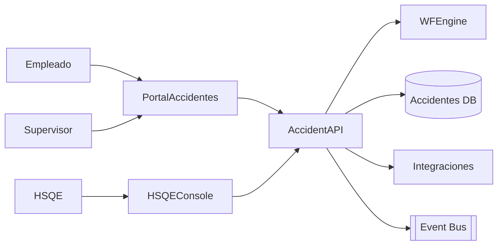

# Arquitectura · Accidentabilidad

## Componentes

### Accident API
- Entidades: Incidentes, Tipos (accidente, casi accidente), Clasificaciones, Causas, Acciones Correctivas, Notificaciones, Relaciones con Legajos y Organizació n.
- Funciones: registrar incidentes, adjuntar evidencia, asignar responsables, ejecutar plan de acción, seguimiento.

### Workflow
- Etapas: Reporte inicial → Validación supervisor → Investigación HSQE → Notificaciones (ART/autoridades) → Cierre/acciones → Seguimiento.
- SLA y recordatorios.

### Integraciones
- **Medicina Laboral**: sincroniza datos clínicos y licencias.
- **Tiempos**: genera ausencias por accidente.
- **Integrations Hub**: exportes a ART, ministerios, Data Lake.
- **Reclamos**: conexión con Quejas si corresponde.

## Modelo de datos (conceptual)
| Entidad | Campos |
| --- | --- |
| `Incidents` | `Id`, `LegajoId`, `Fecha`, `Ubicacion`, `Tipo`, `Gravedad`, `Descripcion`, `Estado`, `WorkflowInstanceId` |
| `Investigations` | `Id`, `IncidentId`, `Responsable`, `Hallazgos`, `Causas`, `Recomendaciones` |
| `Actions` | `Id`, `IncidentId`, `Descripcion`, `Responsable`, `FechaCompromiso`, `Estado` |
| `Notifications` | `Id`, `IncidentId`, `Destino`, `Fecha`, `Resultado` |

## Seguridad
- Roles: Empleado, Supervisor, HSQE, Médico, Administrador.
- Sensibilidad: datos personales + médicos (aplicar controles de privacidad).

---
*Blueprint conceptual.*
