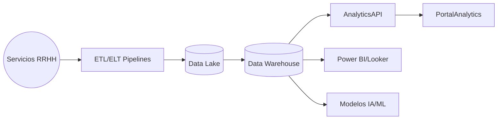

# Arquitectura · Analytics / Reportes

## Componentes

### ETL/ELT
- Pipelines (ADF/Databricks) que extraen datos de servicios (APIs, eventos, bases) y los depositan en Data Lake / Warehouse con esquemas estandarizados (Star Schema, Data Vault).

### Warehouse & Analytics API
- Modelos fact/dimension: FactLiquidacion, FactVacaciones, FactTiempo, DimLegajo, DimOrganizacion, etc.
- API GraphQL/REST para consultas agregadas (ej. headcount, ausentismo, costos, KPI de reclamos).

### BI / Dashboards
- Power BI/Looker/Grafana para dashboards interactivos (People Analytics, D&I, Payroll, Tiempos, Beneficios, Seguridad, Finances).
- Portal Analytics en Portal Empleado para roles autorizados.

### IA/ML
- Modelos de predicción (rotación, ausentismo, headcount forecasting) y alertas.

## Seguridad
- Gobernanza de datos (Rol-based, row-level security), catalogación (Purview), auditoría.
- Datos sensibles (salud, finanzas) con encriptación/anonymization.

---
*Blueprint conceptual.*
