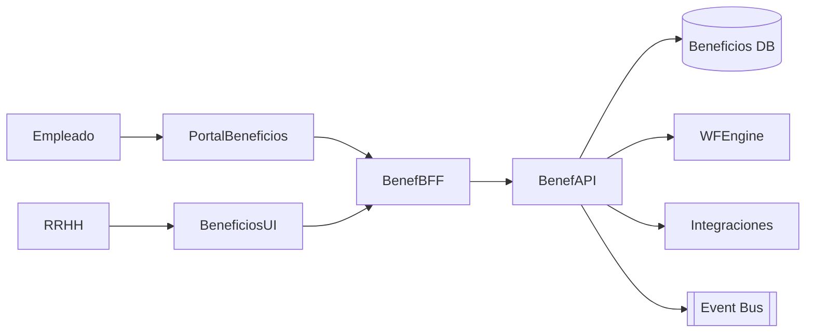

# Arquitectura · Beneficios

## Componentes

### Benef API
- Entidades: Beneficios (tipos, planes), Proveedores, Campañas, Inscripciones, Reembolsos, Saldo flexible, Registros de uso.
- Funciones: catálogo, reglas de elegibilidad, inscripciones, seguimiento, reembolsos.

### Integraciones
- Proveedores externos (API/SFTP) para activar beneficios (ej. seguros, vales comida, gimnasios).
- Liquidación/Tesorería: descuentos y pagos.
- Presupuesto: control de costos vs plan.
- Integrations Hub: reportes regulatorios y contables.

### Workflow
- Aprobaciones para beneficios especiales, reembolsos, cambios de plan, renovaciones automáticas.

## Modelo de datos (conceptual)
| Entidad | Campos |
| --- | --- |
| `Benefits` | `Id`, `Nombre`, `Descripcion`, `Categoria`, `ProveedorId`, `Costo`, `Moneda`, `Elegibilidad`, `Estado` |
| `Enrollments` | `Id`, `BenefitId`, `LegajoId`, `Estado`, `Fecha`, `Monto`, `Renovacion` |
| `Claims` | `Id`, `EnrollmentId`, `Tipo`, `Monto`, `Estado`, `Adjuntos` |
| `FlexibleWallets` | `LegajoId`, `Saldo`, `Moneda`, `Historial` |
| `Providers` | `Id`, `Nombre`, `Tipo`, `Contacto`, `Integracion` |

## Seguridad
- Roles: Empleado, RRHH Beneficios, Administrador, Proveedor.
- Auditoría, manejo de datos sensibles (salud), consentimientos.

---
*Blueprint conceptual.*
