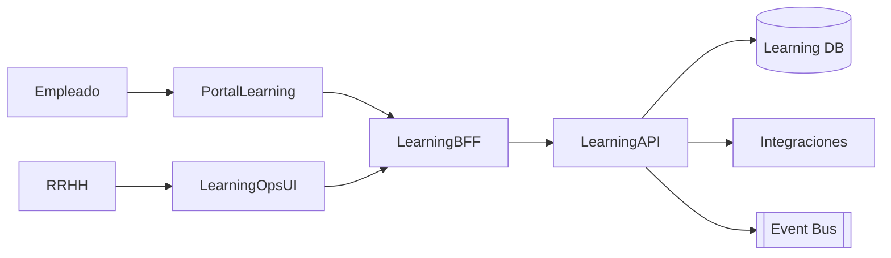

# Arquitectura · Capacitaciones

## Componentes

### Learning API
- Entidades: Cursos, Sesiones (calendar), Contenido, Instructores, Inscripciones, Asistencias, Evaluaciones, Certificados.
- Relaciones con Legajos (participantes) y Organización (propiedad de cursos, centros de costo).

### UI/Experiencia
- Portal Empleado: catálogo, filtros, inscripción, tracking, contenidos, evaluación post-curso.
- Learning Ops: creación de cursos, cargas masivas, aprobaciones, reportes, integraciones LMS externos.

### Integraciones
- Nucleus WF: workflows de aprobación (cursos, inscripciones, certificaciones).
- Legajos/Evaluación: sincroniza planes de desarrollo y datos de capacitación en el legajo.
- Integrations Hub: envía reportes a ministerios o sistemas externos.
- Data/Analytics: dashboards de compliance, horas de capacitación, etc.

## Modelo de datos (conceptual)
| Entidad | Campos |
| --- | --- |
| `Courses` | `Id`, `Nombre`, `Descripción`, `Tipo`, `Duración`, `Modalidad`, `Estado` |
| `Sessions` | `Id`, `CourseId`, `Fecha`, `Lugar`, `Capacidad`, `Estado` |
| `Enrollments` | `Id`, `SessionId`, `LegajoId`, `Estado`, `Resultado`, `CertificadoUrl` |
| `Instructors` | `Id`, `Nombre`, `Proveedor`, `Datos` |
| `Content` | `Id`, `CourseId`, `Tipo`, `Url`, `Duración` |
| `Evaluations` | `Id`, `SessionId`, `LegajoId`, `Puntaje`, `Comentarios` |

## Seguridad
- Roles: Empleado, Jefe, RRHH, Instructor, Admin.
- Autorizaciones para crear cursos, aprobar inscripciones, emitir certificados.

---
*Blueprint conceptual.*
