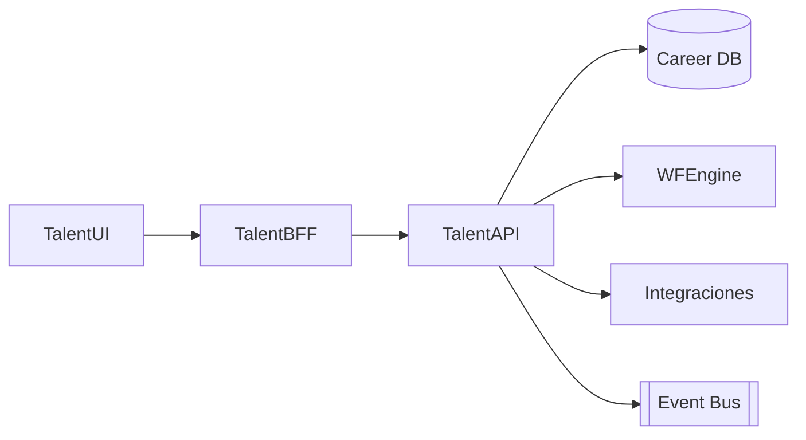

# Arquitectura · Planes de Carrera & Sucesión

## Componentes

### Talent API
- Entidades: Planes de carrera, Objetivos de carrera, Sucesores (candidatos), Posiciones críticas, Pools de talento, Matrices 9-box, Planes de desarrollo.
- Funciones: registrar aspiraciones, mapas de sucesión, readiness, action plans.

### Integraciones
- Legajos (datos del colaborador, historial), Evaluación (scores, potencial), Capacitaciones (planes), Organización (posiciones), Beneficios (programas), Portal Empleado (vista personal de plan).

### Workflow
- Revisión anual de planes, actualizaciones de sucesores, aprobaciones de HRBP y comité ejecutivo.

## Modelo de datos (conceptual)
| Entidad | Campos |
| --- | --- |
| `CareerPlans` | `Id`, `LegajoId`, `Objetivos`, `Horizonte`, `MentorId`, `Estado` |
| `SuccessionPositions` | `Id`, `PositionId`, `Criticidad`, `Sucesores` (lista con `LegajoId`, `Readiness`, `Prioridad`) |
| `DevelopmentPlans` | `Id`, `CareerPlanId`, `Accion`, `Fecha`, `Estado` |
| `TalentPools` | `Id`, `Nombre`, `Criterios`, `Miembros` |

## Seguridad
- Roles: Empleado (vista personal), Manager, HRBP, Talent CoE, Comité.
- Privacidad alta (datos sensibles de carrera/potencial).

---
*Blueprint conceptual.*
