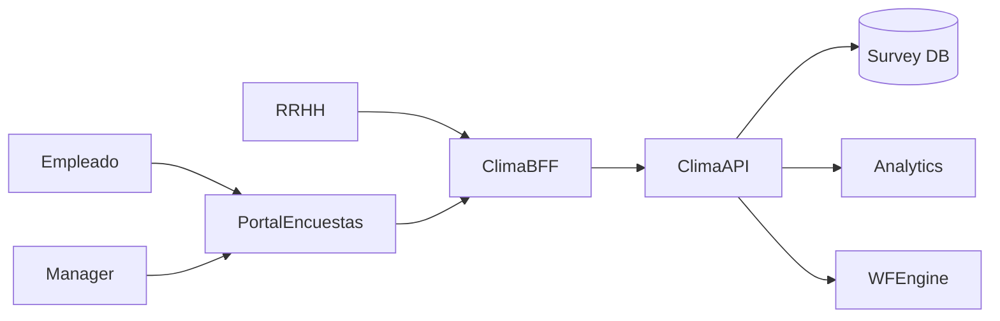

# Arquitectura · Clima / Encuestas

## Componentes

### Clima API
- Entidades: Campañas, Preguntas, Segmentos, Respuestas (anónimas/identificadas), Acciones, Notificaciones.
- Funciones: crear encuestas, distribuir, recolectar, analizar, asignar acciones.

### Integraciones
- Portal Empleado (encuestas, pulse, micro surveys).
- Analytics/BI para dashboards y alertas.
- Nucleus WF para planes de acción.
- Beneficios, Carrera, Evaluación consumen resultados para iniciativas.

## Modelo de datos (conceptual)
| Entidad | Campos |
| --- | --- |
| `Campaigns` | `Id`, `Nombre`, `Tipo`, `Inicio`, `Fin`, `Segmentos`, `Estado` |
| `Questions` | `Id`, `CampaignId`, `Tipo`, `Texto`, `Opciones`, `Peso` |
| `Responses` | `Id`, `CampaignId`, `Segmento`, `LegajoId?`, `Respuestas`, `Timestamp` |
| `ActionPlans` | `Id`, `CampaignId`, `OrgUnitId`, `Responsable`, `Estado`, `Notas` |

## Seguridad
- Anonimato configurable, agregaciones mínimas, RLS para dashboards.

---
*Blueprint conceptual.*
