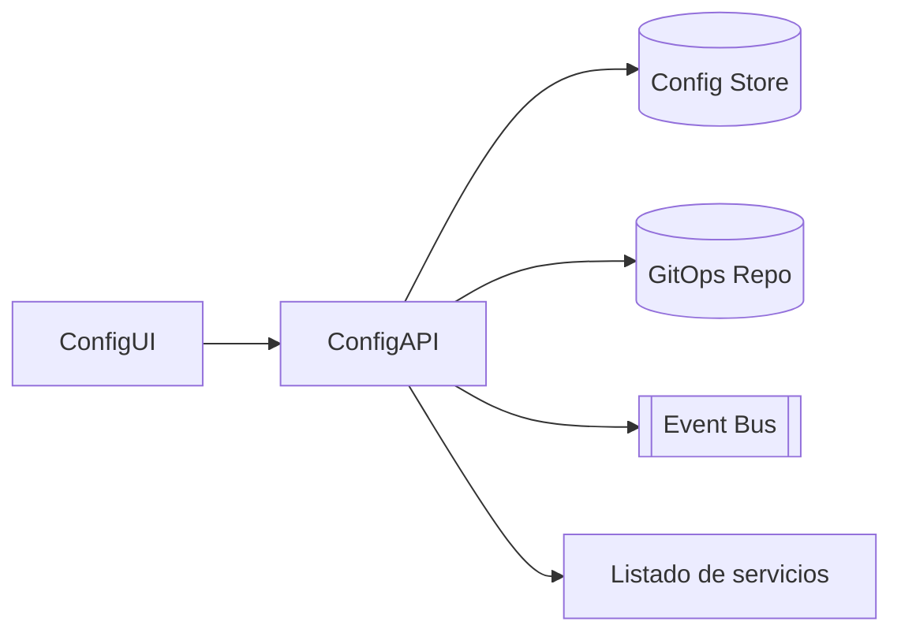

# Arquitectura · Configuración Avanzada

## Componentes

### Config API
- Entidades: Parámetros globales/locales, Catálogos (tipos, listas), Diccionarios, Feature Flags, Conexiones.
- Funciones: CRUD, versionado, migraciones, releases por ambiente, export/import.

### GitOps / storage
- Configuración declarativa (YAML/JSON) versionada en repositorio Git.
- Pipelines para desplegar a ambientes (Dev/Test/Prod).

### UI Config Center
- Administra catálogos, edita parámetros, dispara releases y visualizar auditoría/logs.

### Integraciones
- Servicios de HR (Personal, Tiempos, Vacaciones, etc.) consumen Config API y/o config bundles.
- Integrations Hub usa conexiones y catálogos.

## Modelo de datos (conceptual)
| Entidad | Campos |
| --- | --- |
| `Parameters` | `Id`, `Clave`, `Valor`, `Tipo`, `Ambiente`, `Version`, `Metadata` |
| `CatalogEntries` | `Id`, `Catalogo`, `Codigo`, `Descripcion`, `Estado`, `Orden` |
| `Connections` | `Id`, `Tipo`, `Config`, `SecretRef` |
| `Releases` | `Id`, `Parametros`, `Catalogos`, `Ambiente`, `Estado`, `Fecha` |

## Seguridad
- Roles: `ConfigAdmin`, `CatalogEditor`, `Viewer`.
- Auditoría, approvals, compliance.

---
*Blueprint conceptual.*
