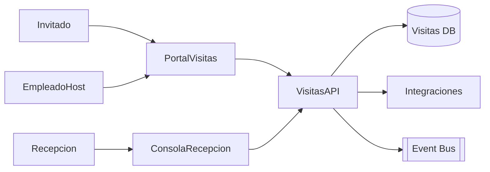

# Arquitectura · Control de Visitas

## Componentes

### Visitas API
- Entidades: Invitaciones, Visitas, Anfitriones, Credenciales, Checkpoints.
- Funciones: preregistro, generación de invitaciones (email/QR), aprobación por anfitrión/seguridad, check-in/out, historial.

### UI / Apps
- Portal para empleados: crear invitaciones, ver estado, notificaciones.
- Consola Recepción/Seguridad: ver agenda diaria, verificar identidades, imprimir/activar badges.
- Applicación mobile/QR para visitantes (opcional) para agilizar ingreso.

### Integraciones
- Legajos (datos anfitriones, autorizaciones).
- Seguridad física / control de acceso (API/SDK para encender badges, logging).
- Integrations Hub (reportes a compliance, exportes a ERP/BI).
- Calendario (Graph API) para agregar citas automáticamente.

## Modelo de datos (conceptual)
| Entidad | Campos |
| --- | --- |
| `Invitations` | `Id`, `HostLegajoId`, `Visitante`, `Empresa`, `Email`, `Fecha`, `Estado`, `QR`, `Notas` |
| `Visits` | `Id`, `InvitationId`, `CheckIn`, `CheckOut`, `BadgeId`, `Observaciones` |
| `Hosts` | `LegajoId`, `Permisos`, `AreasPermitidas` |
| `Checkpoints` | `Id`, `VisitId`, `Evento`, `Timestamp`, `Usuario` |

## Seguridad
- Roles: `Empleado`, `Recepcion`, `Seguridad`, `Administrador`.
- Auditoría completa de ingresos/egresos.
- Cumplimiento de normativas (registro de visitantes, retención de datos, consentimiento).

---
*Blueprint conceptual para modernizar Control de Visitas.*
