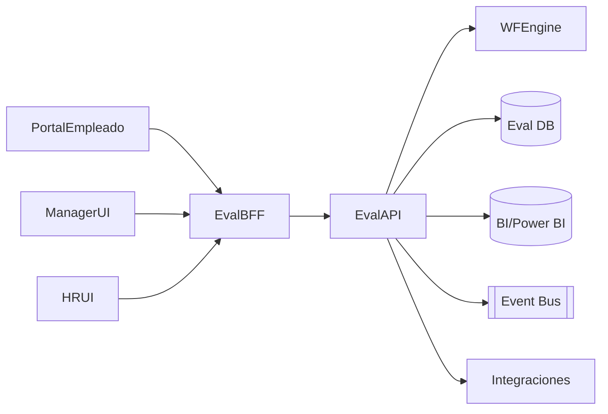

# Arquitectura · Evaluación de Desempeño

## Componentes

### Servicios
1. **Evaluación API** (ASP.NET Core)
   - Entidades: Ciclos, Objetivos, Competencias, Evaluaciones, Feedback, Calibraciones.
   - Endpoints para configurar ciclos, asignar objetivos, capturar respuestas.
2. **BFF / UI**
   - Interfaces para empleado, jefe, HRBP; dashboards de seguimiento.
3. **Workflow Engine (Nucleus WF)**
   - Etapas: Autoevaluación → Jefe → Pares/Feedback → HRBP/Calibración → Cierre.
   - Recordatorios automáticos, escalamiento, SLA.
4. **Analytics**
   - Conexión a Power BI/Looker para dashboards (curvas, calibraciones, NPS, 9-box).

## Modelo de datos (conceptual)
| Entidad | Campos |
| --- | --- |
| `EvaluationCycles` | `Id`, `Nombre`, `Periodo`, `Estado`, `Configuración` |
| `Objectives` | `Id`, `LegajoId`, `Descripción`, `Peso`, `Status` |
| `Competencies` | `Id`, `Nombre`, `Descripción`, `Escala` |
| `Evaluations` | `Id`, `CycleId`, `EvaluadoId`, `EvaluadorId`, `Tipo`, `Estado`, `Score`, `Comentarios` |
| `FeedbackEntries` | `Id`, `EvaluadoId`, `AutorId`, `Contenido`, `Privado` |
| `CalibrationSessions` | `Id`, `CycleId`, `OrganizacionId`, `Estado`, `Notas` |

## Integraciones
- **Personal/Organización**: obtiene responsables, jerarquías, unidades.
- **Nucleus WF**: gestiona tareas y aprobaciones.
- **Comp & Compensación**: exporta resultados a merit/bonos.
- **Talent / Learning**: genera planes de desarrollo basados en resultados.

## Seguridad
- Roles: Empleado, Manager, HRBP, Administrador, Comité.
- Autorización basada en jerarquía + permisos especiales (comités, calibraciones).
- Auditoría y versionado (historial por evaluación).

---
*Blueprint conceptual dado que no hay doc detallada en repo.*
