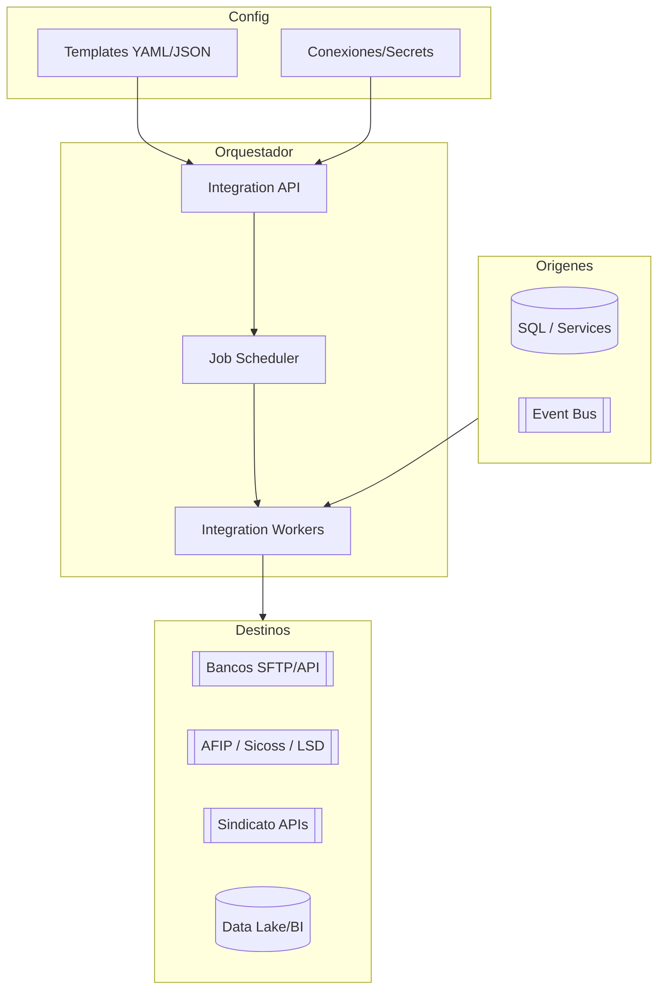

# Arquitectura · Integraciones

## Visión actual
- `Generico.exe` ejecuta definiciones XML, consulta SQL, genera archivo, reemplaza caracteres y lo guarda vía FileServiceIO.
- Templates por destino (bancos, legales, sindicatos) ubicados en `InterfacesOut/Definitions`.
- Interfaces de entrada (Liquidación/Tiempos) definidas en `Interfaces/NucleusRH/Base/...` con queries.

## Arquitectura propuesta


### Servicios
1. **Integration API**
   - CRUD de templates, conexiones, ejecuciones.
   - Versionado y validación de templates.
2. **Scheduler / Job Engine**
   - Programación (cron) y ejecuciones ad-hoc.
   - Soporta triggers event-driven (cuando Liquidación termina, cuando Tiempos exporta horas).
3. **Workers**
   - Ejecutan templates: consultan servicios (REST/SQL), transforman datos (Liquid, Scriban, JsonNet), generan archivos o payloads y los entregan (SFTP, API, Blob).
   - Librería de conectores (Bancos, AFIP, Sindicatos, Data Lake, Webhooks).
4. **Observabilidad**
   - Logs estructurados, métricas (jobs OK/FAIL), eventos persistidos y alertas.

## Modelo de plantillas (YAML ejemplo)
```yaml
name: libro-sueldos-digital
schedule: "0 6 * * MON"
source:
  type: sql
  connection: rrhh-sql
  query: ./queries/libro_sueldos.sql
transform:
  type: liquid
  template: ./templates/libr o_sueldos.liquid
destination:
  type: sftp
  connection: afip-sftp
  path: /uploads/{{periodo}}/lsd_{{empresa}}.txt
postActions:
  - type: email
    to: payroll@empresa.com
```

## Integración con otros módulos
- Liquidación/Tiempos/Licencias publican eventos `ExportReady` → Integration Hub genera archivos.
- Personal/Selección envían datos a ATS/HRIS externos via API connectors.
- Reports y Data Lake reciben cargas periódicas.

## Seguridad
- Secret vault para conexiones (SFTP/API keys).
- Auditoría de ejecuciones (quién lanzó, qué archivo, checksum).
- Versionado de templates y approvals.

---
*Referencias: `InterfacesOut/Source/Generico`, `Definitions/*.xml`, `Interfaces/NucleusRH/Base/*`.*
