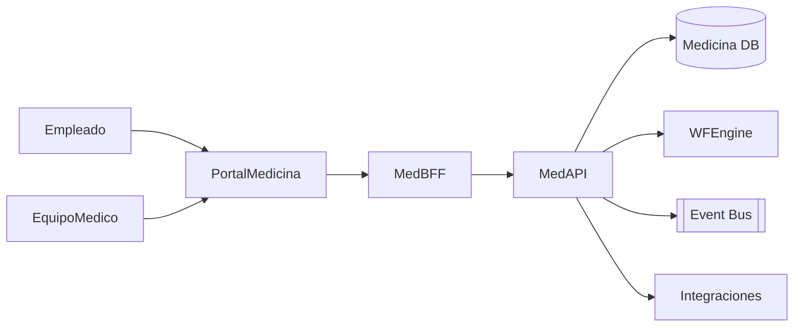

# Arquitectura · Medicina Laboral

## Componentes

### Med API
- Entidades: Exámenes, Proveedores médicos, Licencias médicas, Accidentes, Campañas, Indicadores (IMC, vacunas, etc.).
- Endpoints para programar exámenes, registrar resultados, emitir aptos/no aptos, gestionar licencias.

### Workflow
- Procesos: Solicitud examen, cita, resultado, apto/no apto, seguimiento, alta.
- Notificaciones a empleado/jefe, SLA regulatorios.

### Integraciones
- Tiempos: crea ausencias automáticas con justificativo.
- Liquidación: impacta licencias médicas remuneradas/no remuneradas.
- Integraciones: exportes a sistemas externos (ART, aseguradoras, ministerios).
- Reclamos/Accidentabilidad: comparte datos de accidentes y seguimientos.

### Reportes
- Panel con KPIs de salud (aprobados, pendientes, campañas, vacunas).
- Reportes legales (ej. Registro de exámenes, aptos, licencias).

## Modelo de datos (conceptual)
| Entidad | Campos |
| --- | --- |
| `MedicalExams` | `Id`, `LegajoId`, `Tipo`, `ProveedorId`, `Fecha`, `Estado`, `Resultados`, `Adjuntos` |
| `MedicalLicenses` | `Id`, `LegajoId`, `Tipo`, `FechaDesde`, `FechaHasta`, `Diagnostico`, `Adjuntos`, `Estado` |
| `Providers` | `Id`, `Nombre`, `Tipo`, `Contacto`, `Habilitaciones` |
| `Campaigns` | `Id`, `Nombre`, `Objetivo`, `Vigencia`, `Población`, `Resultados` |
| `AccidentCases` | `Id`, `LegajoId`, `Fecha`, `Tipo`, `Estado`, `Notas` |

## Seguridad
- Roles: `Medico`, `RRHH`, `Empleado`, `Supervisor`.
- Confidencialidad: controles estrictos, encripción, auditoría (datos de salud sensibles).
- Consentimientos para compartir resultados.

---
*Blueprint conceptual basado en prácticas de salud ocupacional.*
