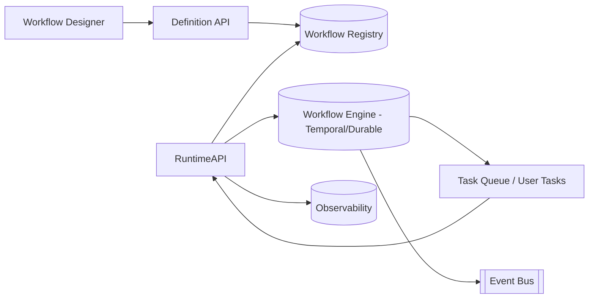

# Arquitectura · Nucleus WF

## Componentes legado
| Componente | Ubicación | Descripción |
| --- | --- | --- |
| WF / PROCESS / NODE / FORM | `Class/NucleusWF/Base/Definicion/lib_v11.Workflows.*` | Definen la estructura del workflow (procesos, nodos, formularios, variables). |
| Organigramas | `lib_v11.Organigramas.ORGANIGRAMA.cs` | Roles/responsables. |
| Integración | `lib_v11.Integracion.INT_MAG.cs` | Interfaces e integración externa. |
| Instancias | `Class/NucleusWF/Base/Ejecucion/lib_v11.Instancias.INSTANCE.cs` | Runtime, logs, errores. |
| Menú/Reportes | `Menu/NucleusWF/Base/WRK.menu.xml`, `Html/NucleusWF/Base/*` | Consolas y reportes HTML. |

## Propuesta moderna

### Servicios
1. **Definition API**
   - CRUD de workflows, versiones, formularios, variables, roles.
   - Valida y publica definiciones hacia el engine (Temporal/Durable) y genera artefactos (YAML/JSON).
2. **Runtime API**
   - Endpoints para iniciar instancias, listar tareas, completar actividades, abortar, reintentar.
   - Manejo de parámetros, adjuntos, logs y SLA.
3. **Engine**
   - Temporal/Durable Functions o Camunda Zeebe (según preferencia). Maneja colas, actividades, timers, compensaciones.
   - Actividades custom permiten invocar servicios de RRHH, correo, integraciones.
4. **Designer UI**
   - Editor visual drag & drop con versionado, publicación, análisis de impacto.
   - Permite importar workflows existentes (parser de `*.WF.xml`).
5. **Observer/Analytics**
   - Consolas modernas (React) para monitorear instancias, tareas asignadas, métricas (tiempo etapa, SLA, backlog). Datos en Elastic/OpenSearch + Grafana.

## Modelo de datos
| Tabla/Entidad | Contenido |
| --- | --- |
| `WorkflowDefinitions` | Id, nombre, versión, estado, metadata, JSON (YAML) del proceso. |
| `WorkflowForms` | Definición de formularios (campos, validaciones, layout). |
| `WorkflowRoles` | Roles y responsables (conexión a catálogos de Personal). |
| `WorkflowInstances` | Instancias activas, estado, timestamps, payload, SLA. |
| `WorkflowTasks` | Tareas humanas, asignatarios, prioridad, vencimiento. |
| `WorkflowLogs` | Eventos, errores, transiciones. |

## Integraciones
- **Entrada**: APIs de módulos (Personal, Vacaciones, Reclamos, etc.) que disparan workflows o completan tareas.
- **Salida**: eventos (Kafka/Service Bus) `WorkflowStarted`, `TaskAssigned`, `WorkflowCompleted`, `WorkflowFailed`.
- **Attachments**: almacenamiento en Blob Storage.

## Seguridad
- OIDC + roles (`WF.Admin`, `WF.Designer`, `WF.Supervisor`, `WF.User`).
- Versionado con permisos (draft, published, deprecated).
- Auditoría de cambios y ejecuciones.

---
*Referencias: `docs/11_nucleus_wf.md`, `Class/NucleusWF/Base/*`, `Menu/NucleusWF/Base/WRK.menu.xml`.*
