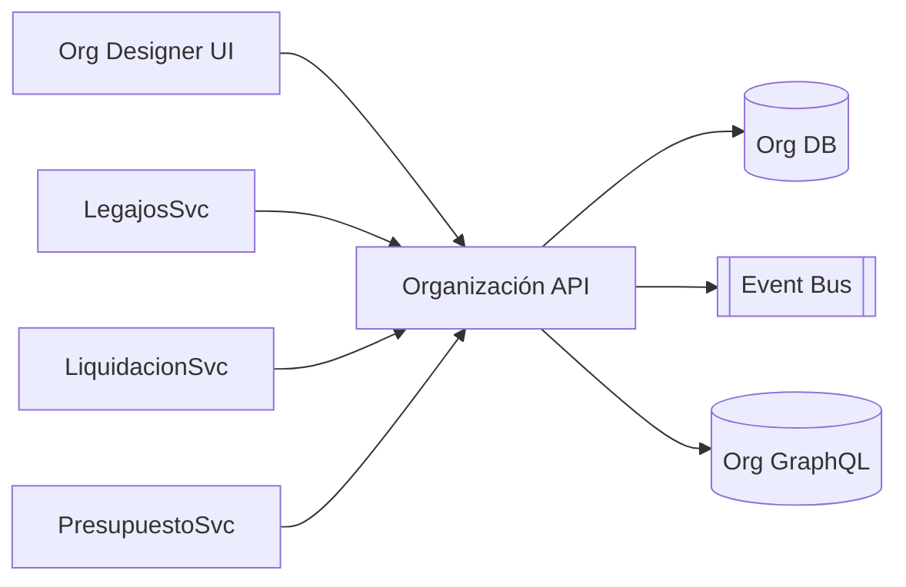

# Arquitectura · Organización

## Componentes legado
- Clases `lib_v11.*` en `Class/NucleusRH/Base/Organizacion` (empresas, posiciones, estructuras, organigramas).
- Formularios Nomad (ABMs de empresas, posiciones, grupos, centros de costo).
- Catálogos utilizados por Legajos, Vacaciones, Tiempos, Liquidación, Integraciones.

## Arquitectura moderna

### Servicios
1. **Organización API (ASP.NET Core)**
   - Entidades: Empresas, Unidades Organizativas, Posiciones, Centros de Costo, Organigramas, Estructuras temporales.
   - CRUD + versionado de organigramas.
2. **Org Designer UI**
   - Editor visual (drag & drop) para organigramas, matrices, reporting lines.
   - Publicación de versiones y simulaciones (what-if).
3. **GraphQL/Read API**
   - API de consulta para Legajos, Liquidación, Presupuesto, Integraciones.
4. **Events & Sync**
   - Eventos `OrgUnitCreated`, `OrgUnitUpdated`, `PositionAssigned`, etc. para notificar servicios dependientes.

## Modelo de datos (conceptual)
| Entidad | Campos |
| --- | --- |
| `Companies` | `Id`, `Nombre`, `Pais`, `Moneda`, `Estado` |
| `OrgUnits` | `Id`, `CompanyId`, `Nombre`, `Tipo`, `PadreId`, `CentroCostoId`, `Activo` |
| `Positions` | `Id`, `OrgUnitId`, `Nombre`, `Nivel`, `Perfil`, `Estado` |
| `OrgStructures` | `Id`, `Nombre`, `Version`, `VigenciaDesde/Hasta`, `Published` |
| `OrgEdges` | `StructureId`, `UnidadPadre`, `UnidadHija` |
| `CostCenters` | `Id`, `CompanyId`, `Código`, `Descripción`, `Estado` |

## Integraciones
- **Legajos**: obtiene `OrgUnit`, `Position`, `CostCenter` para cada empleado.
- **Presupuesto/Talento**: usa la estructura para proyecciones y headcount planning.
- **Liquidación/Tiempos**: referencias a `OrgUnit` y `CostCenter` en cálculos.
- **Integraciones**: exporta estructuras a ERP/BI; importa desde sistemas maestros si aplica.

## Seguridad
- Roles: `OrgAdmin`, `OrgEditor`, `OrgViewer`.
- Versionado y publicación controlada (draft → review → published).
- Auditoría de cambios y simulaciones.

---
*Referencias: `Class/NucleusRH/Base/Organizacion`, `docs/02_arquitectura_y_componentes.md`.*
