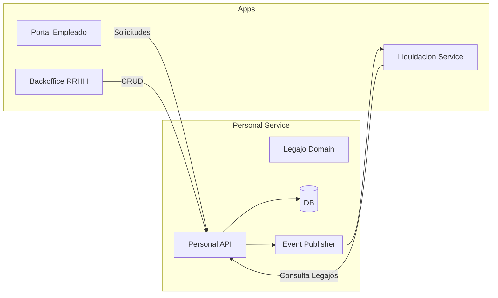

# Módulo de Personal · Blueprint

## Objetivo
Replicar y modernizar las capacidades del módulo “Personal” de Nucleus RH 23.01 (carpetas `Class/NucleusRH/Base/Personal`, workflows en `Workflow/NucleusRH/Base/Personal`). Este módulo administra los legajos de empleados, datos personales, documentación, familiares y operaciones de autoservicio/aprobación.

## Funciones detectadas en la versión 23.01
- **Legajos** (`lib_v11.Legajo.PERSONAL.cs`): alta/baja, cambio de documento, AFJP, domicilios, familiares, imágenes y atributos auxiliares.
- **Workflows de datos personales** (`Workflow/NucleusRH/Base/Personal/Solicitud.WF.xml` + `lib_v11.WFSolicitud.SOLICITUD.cs`): solicitudes de cambio con aprobación y actualización del legajo.
- **Interfaces**: exportes Kubo, licencias, remuneraciones, egresos, clasificadas en `Class/.../Interface*.cs`.
- **Diccionarios/combos**: nacionalidades, tipos de documento/domicilio, AFJP, sindicatos.
- **Integraciones**: acceso SQL a `PER01_PERSONAL`, `PER02_PERSONAL_EMP`, `ORG03_EMPRESAS`, etc., para armar la vista del legajo.

## Diseño propuesto (vista general)

## Capas y responsabilidades
1. **API REST (ASP.NET Core 8 / Minimal API + versionado)**
   - Endpoints CRUD de legajos (`/legajos`), familiares, domicilios, documentos.
   - Endpoints para solicitudes de cambio (`/legajos/{id}/solicitudes`).
   - Integraciones con Liquidación (`/legajos/{id}/resumen-payroll`).
2. **Dominio / Aplicación**
   - Entidades: `Legajo`, `Documento`, `Domicilio`, `DatosLaborales`, `Familiar`, `SolicitudCambio`.
   - Servicios: `LegajoService`, `SolicitudService`, `ImagenService`.
   - Reglas inspiradas en `lib_v11.Legajo.PERSONAL.cs`: validaciones de CUIL, AFJP, manejo de domicilios fiscales.
3. **Persistencia**
   - EF Core + SQL Server (future-proof). Durante la PoC se puede usar un store JSON similar a Liquidación.
   - Tablas sugeridas: `Legajos`, `LegajosLaborales`, `Domicilios`, `Documentos`, `Familiares`, `SolicitudesCambio`, `HistorialLegajo`.
4. **Integración con Liquidación**
   - Publicar eventos `LegajoUpdated` (Service Bus/Kafka) al aprobar cambios.
   - Endpoint `GET /legajos/{id}/liquidacion-profile` con datos clave para payroll (cuits, convenciones, centros de costo).
5. **UI / Experiencia**
   - Portal Empleado: formulario de datos personales inspirado en `Solicitud.WF.xml` (tabs General/Domicilio).
   - Backoffice: vista 360° con fichas (datos personales, historia laboral, documentos, familiares).
   - Workflow viewer para aprobadores.

## Compatibilidad con versión 23.01
- Se replican campos obligatorios (nombre, apellido, documento, CUIL, domicilios, contacto).
- Se mantiene el flujo de aprobación con estados `SOLICITAR`, `PENDAPROB`, `APROBADA`, `RECHAZADA`.
- Se soportan catálogos (tipos de documento, nacionalidad, etc.) vía endpoints `/catalogos`.
- Las interfaces Kubo/licencias se reemplazarán por exportes/eventos, respetando nomenclaturas.

## Artefactos a generar
- `personal-service/` (API + dominio + persistencia).
- `personal-ui/` (SPA para RRHH + vistas en Portal Empleado).
- Documentación: API, modelo de datos, workflows, integración con Liquidación.

---
*Blueprint generado el 2026-03-09 con base en `Class/NucleusRH/Base/Personal` y `Workflow/NucleusRH/Base/Personal` de la versión 23.01.*
