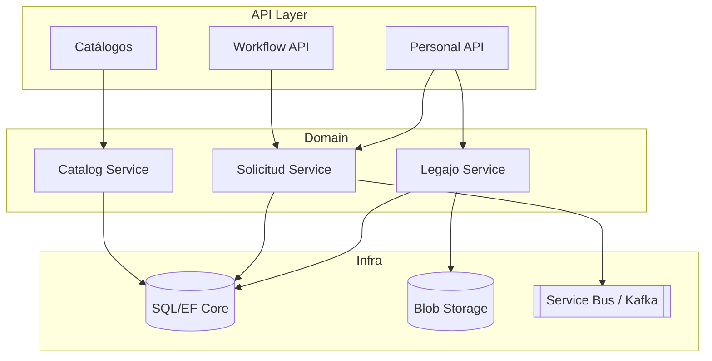

# Arquitectura del módulo Personal

## Dominio (basado en 23.01)
| Entidad | Descripción | Fuente legado |
| --- | --- | --- |
| Legajo (PERSONAL) | Datos personales + laborales (documento, AFJP, empresa, posición). | `lib_v11.Legajo.PERSONAL.cs`, tablas `PER01`, `PER02` |
| Domicilio (DOMIC_PER) | Domicilios fiscales y de contacto. | `lib_v11.Legajo.PERSONAL.cs` switch cases `MyDOM` |
| Documento (DOCUMENTO_PER) | Historia de documentos, validación CUIL. | `Cambio_Documento()` |
| Familiar | Información de grupo familiar, dependientes. | `GetFams`, `GetDatosFam` |
| SolicitudCambio | Workflow para autoservicio. | `Workflow/NucleusRH/Base/Personal/Solicitud.WF.xml` |
| Imagen/Recursos | Fotos y documentos anexos. | `lib_v11.ExpImagenes.cs`, `lib_v11.ImportarFotosPersonal.cs` |

## Componentes propuestos

## Servicios internos
- **LegajoService**
  - CRUD de legajos (datos personales, laborales, documentación, familiares).
  - Exponer resumen de payroll para Liquidación (`/legajos/{id}/payroll-profile`).
  - Asegurar consistencia CUIL/sexo (lógica tomada del script `val_cuil`).
  - Emitir eventos `LegajoUpdated` cuando cambian atributos relevantes.
- **SolicitudService**
  - Maneja solicitudes autoservicio (creación, listado, aprobación, rechazo).
  - Reutiliza los estados `SOLICITAR`, `PENDAPROB`, `APROBADA`, `RECHAZADA`.
  - Al aprobar, aplica cambios sobre `Legajo` (similar a `AprobarSolicitud`).
- **CatalogService**
  - Expone catálogos `TiposDocumento`, `Nacionalidades`, `TiposDomicilio`, `GruposSanguineos`.
  - Se alimenta de tablas configurables (puede vivir en Config service en futuro).

## API (versión inicial)
- `GET /legajos` (listado paginado, filtros por empresa, posición, estado).
- `POST /legajos` (alta de legajo).
- `GET /legajos/{id}` / `PUT` / `DELETE`.
- `GET /legajos/{id}/familiares`, `POST` etc.
- `GET /legajos/{id}/solicitudes`, `POST` (crear autoservicio), `POST /{solId}/aprobar`.
- `GET /catalogos/{nombre}`.

## Modelo de datos (propuesta)
| Tabla | Campos clave | Comentarios |
| --- | --- | --- |
| `Legajos` | `Id`, `Numero`, `Nombre`, `Apellido`, `CUIL`, `Sexo`, `FechaIngreso`, `EmpresaId`, `PosicionId`, `Estado` | Equivalente a `PER01` + `PER02` |
| `LegajosDocumentos` | `Id`, `LegajoId`, `TipoDocumento`, `Numero`, `Vigencia` | Historia de documentos |
| `LegajosDomicilios` | `Id`, `LegajoId`, `Tipo`, `Calle`, `Numero`, `LocalidadId`, `EsFiscal` | Basado en `DOMIC_PER` |
| `LegajosFamiliares` | `Id`, `LegajoId`, `Tipo`, `Nombre`, `Documento`, `FechaNac`, `EsCarga` | `GetFams` |
| `LegajosLaborales` | `Id`, `LegajoId`, `SindicatoId`, `Convenio`, `Categoria`, `CentroCostoId`, `AFJP`, `ObraSocial` | Datos para liquidación |
| `SolicitudesCambio` | `Id`, `LegajoId`, `Estado`, `Tipo`, `Payload`, `AprobadorId` | Replica workflow XML |

## Integración con Liquidación
- API: `GET /legajos/{id}/liquidacion-profile` devuelve datos de `Legajos`, `LegajosLaborales`, `LegajosDomicilios` necesarios.
- Eventos: `LegajoUpdated`, `LegajoCreated` se publican para que Liquidación sincronice legajos.
- Escenario batch: exportes JSON/CSV equivalentes a `InterfacePersonal.NomadClass.XML` para sistemas externos.

## Workflows y autoservicio
- Motor Temporal/Durable reimplementa `Solicitud.WF.xml`.
- Formularios SPA replican secciones `General` y `Domicilio` con validaciones (CUIL, combos, helpers).
- Roles: empleado solicita, RRHH aprueba; se persiste bitácora.

## Seguridad & Compliance
- Endpoints protegidos con OIDC + roles (`RRHH`, `Aprobador`, `Empleado`).
- Auditoría de cambios por atributo (quién cambió qué y cuándo), inspirado en `SELECT` list del workflow.
- Adjuntos se almacenan en Blob Storage con referencias en `LegajosDocumentos`.

---
*Referencias: `Workflow/NucleusRH/Base/Personal/Solicitud.WF.xml`, `Class/NucleusRH/Base/Personal/lib_v11.Legajo.PERSONAL.cs`, `lib_v11.WFSolicitud.SOLICITUD.cs`.*
