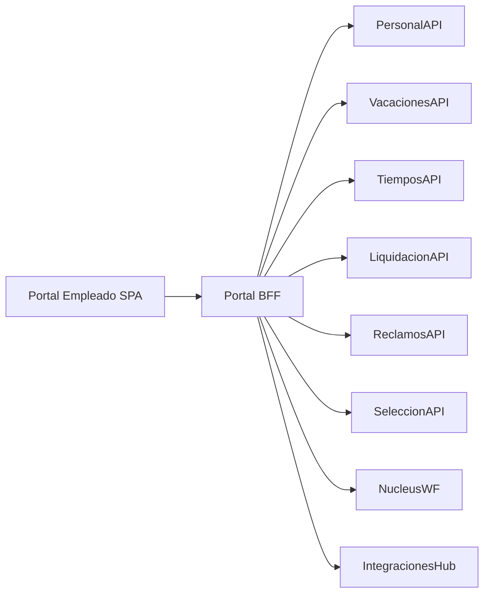

# Arquitectura · Portal Empleado

## Capas

### Portal SPA
- MVP actual: UI estática (HTML/JS) con JWT, bandeja de tareas y solicitudes por Nucleus WF.
- Módulos MVP: Dashboard, Tareas, Recibos (detalle), Solicitudes (vacaciones/datos/reclamos).
- Notificaciones MVP: derivadas de instancias WF y liquidaciones.
- Export de recibos MVP: descarga local JSON/CSV desde el detalle.
- Cache de notificaciones en localStorage para persistencia basica.
- Persistencia real de notificaciones via Portal BFF (SQLite).
- Próximo: Shell SPA React con widgets configurables y microfrontends.

### Portal BFF
- ASP.NET Core/Node que agrega datos, aplica seguridad, caching, feature flags.
- En el MVP se proxya Liquidación y Nucleus WF via BFF (exportes y workflows).

### Identidad y seguridad
- Autenticación OIDC (Azure AD/Entra ID B2E), MFA y políticas de sesión.
- Autorización basada en roles (empleado, manager, RRHH) y atributos (empresa, país, unidad).

### Integraciones
- Consume eventos de Nucleus WF para mostrar tareas.
- Recibe notificaciones de Integrations Hub (por ejemplo, confirmación de recibos enviados).
- APIs push/pull para comunicaciones (Teams, email).

## Features clave
- **Dashboard personalizable**: módulos arrastrables, KPIs personales, accesos rápidos.
- **Bandeja de tareas**: lista de tareas y solicitudes (wf), aprobaciones, alertas.
- **Autoservicio**: formularios React para datos personales, vacaciones, solicitudes varias.
- **Documentos & recibos**: viewer (PDF) con firma digital y secciones de descargas.
- **Soporte mobile**: PWA (Progressive Web App) con push notifications.

## Observabilidad / Analytics
- Telemetría (OpenTelemetry) para performance y errores.
- Analytics/BI (Segment/Power BI) para uso del portal.
- Feature flags (LaunchDarkly/Flipt) para lanzamientos progresivos.

---
*Entrada basada en `docs/10_portal_empleado.md` y módulos autoservicio.*
