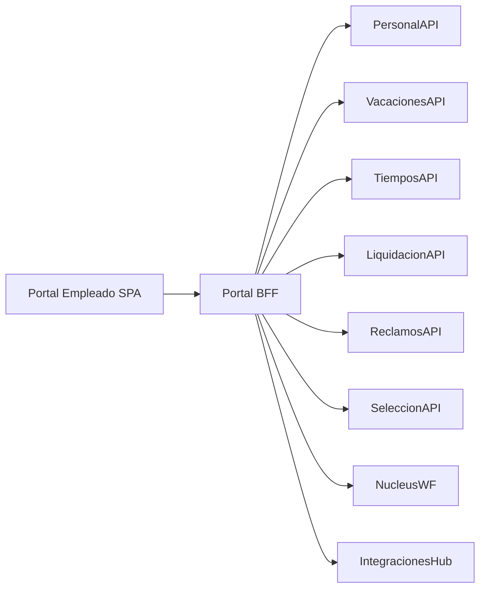

# Arquitectura · Portal Empleado

## Capas

### Portal SPA
- Next.js/React con diseño responsive, tema corporativo, soporte offline/light.
- Módulos: Home, Legajo, Tiempos & Vacaciones, Reclamos, Recibos, Beneficios, WebCV, Tareas.
- Widgets configurables; motor de layout que carga microfrontends.

### Portal BFF
- ASP.NET Core/Node que agrega datos, aplica seguridad, caching, feature flags.
- Expone APIs específicas para el portal (dashboard, bandeja, notificaciones) y actúa como proxy a servicios.

### Identidad y seguridad
- Autenticación OIDC (Azure AD/Entra ID B2E), MFA y políticas de sesión.
- Autorización basada en roles (empleado, manager, RRHH) y atributos (empresa, país, unidad).

### Integraciones
- Consume eventos de Nucleus WF para mostrar tareas.
- Recibe notificaciones de Integrations Hub (por ejemplo, confirmación de recibos enviados).
- APIs push/pull para comunicaciones (Teams, email).

## Features clave
- **Dashboard personalizable**: módulos arrastrables, KPIs personales, accesos rápidos.
- **Bandeja de tareas**: lista de tareas y solicitudes (wf), aprobaciones, alertas.
- **Autoservicio**: formularios React para datos personales, vacaciones, solicitudes varias.
- **Documentos & recibos**: viewer (PDF) con firma digital y secciones de descargas.
- **Soporte mobile**: PWA (Progressive Web App) con push notifications.

## Observabilidad / Analytics
- Telemetría (OpenTelemetry) para performance y errores.
- Analytics/BI (Segment/Power BI) para uso del portal.
- Feature flags (LaunchDarkly/Flipt) para lanzamientos progresivos.

---
*Entrada basada en `docs/10_portal_empleado.md` y módulos autoservicio.*
