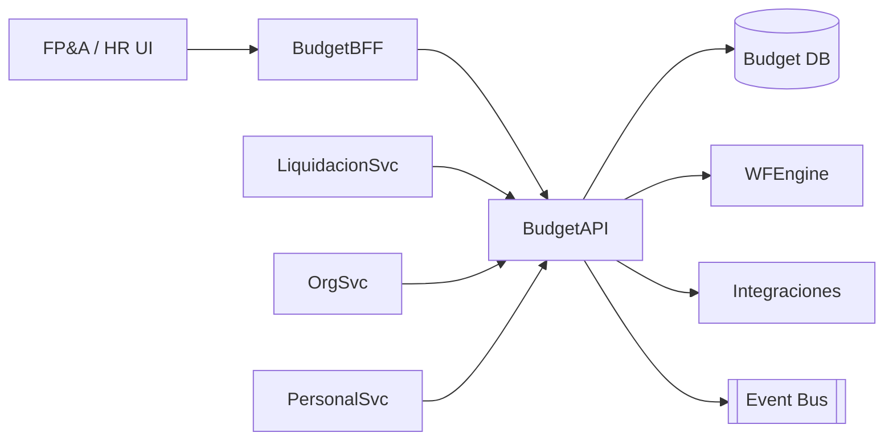

# Arquitectura · Presupuesto de RRHH

## Componentes

### Budget API
- Entidades: Presupuestos (por periodo/escenario), Versiones, Estructuras (centros de costo, posiciones), Supuestos (incrementos salariales, beneficios), Ajustes, Variaciones.
- Cálculo de proyecciones (FTE, costo mensual/anual) y comparación vs real.

### Workflow
- Ciclo: Definición de supuestos → Carga inicial (por unidad) → Revisión/ajustes → Aprobación → Seguimiento (rolling forecast).
- Nucleus WF maneja tareas por unidad/manager, recordatorios y aprobaciones.

### Integraciones
- **Liquidación**: consume costos reales (salarios, cargas, beneficios) para comparar vs presupuesto.
- **Organización**: estructura de centros/posiciones para distribuir presupuesto.
- **Personal**: headcount actual, movimientos planificados.
- **Finanzas/ERP**: exporta escenarios aprobados, recibe top-down targets.

## Modelo de datos (conceptual)
| Entidad | Campos |
| --- | --- |
| `Budgets` | `Id`, `Nombre`, `Periodo`, `Escenario`, `Estado`, `Metadata` |
| `BudgetVersions` | `Id`, `BudgetId`, `Version`, `Publicado`, `Notas` |
| `BudgetLines` | `Id`, `VersionId`, `OrgUnitId`, `PositionId`, `FTE`, `CostoMensual`, `Supuestos` |
| `Assumptions` | `Id`, `BudgetId`, `Tipo`, `Valor`, `Detalle` |
| `Actuals` | `Id`, `Periodo`, `OrgUnitId`, `Costo`, `Fuente` (Liquidación) |
| `Variances` | `BudgetLineId`, `Actual`, `Variance`, `Comentarios` |

## Seguridad
- Roles: `BudgetAdmin`, `FPnA`, `HR`, `Manager`.
- Controles por unidad/empresa; versionado y auditoría de cambios.

---
*Blueprint conceptual.*
