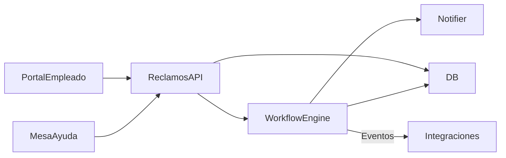

# Módulo Reclamos / Nucleus WF · Blueprint

## Objetivo
Modernizar el módulo de Quejas y Reclamos (carpeta `Class/NucleusRH/Base/QuejasyReclamos`, workflow `Workflow/NucleusRH/Base/QuejasyReclamos/Reclamo.WF.xml`) manteniendo la lógica de seguimiento, categorización y notificaciones, pero sobre una arquitectura moderna (microservicio + workflow engine contemporáneo).

## Funciones identificadas en 23.01
- **Workflow Reclam o**: estados `Inicial → PendClasif → PendResol → Resuelto → PendConf → Final` con eventos de guardado y notificación (ver `docs/03_flujos_y_workflows.md`, `lib_v11.WFReclamos.RECLAMO.cs`).
- **Clases de negocio**: `lib_v11.WFReclamos.RECLAMO.cs` maneja guardado, envío de mails, anexos (`DOCUM_DIG_QYR`).
- **Catálogos**: categorías, orígenes, procesos, tipo de problema, soluciones, oficinas (`*.NomadClass.xml`).
- **Documentos/adjuntos**: `DocumentosDigitales.NomadClass.xml`.
- **Integraciones**: notificaciones via `OutputMails`, exportes a sistemas externos.

## Diseño propuesto

### Componentes
1. **Reclamos API (ASP.NET Core)**: CRUD de reclamos, comentarios, adjuntos, SLA, dashboards. Expuesto como BFF para portal y mesa de ayuda.
2. **Workflow Engine**: Temporal/Durable Functions orquestrando estados y tareas humanas (clasificación, resolución, confirmación).
3. **Notification/Integration Service**: reemplaza `OutputMails`, publica eventos (Service Bus) para ITSM/Finanzas.
4. **Data Store**: PostgreSQL/SQL Server con tablas `Reclamos`, `HistoricoEstados`, `Comentarios`, `Adjuntos`, `Categorias`, etc.
5. **UI**: panel de reclamos, bandeja de tareas, timeline con estados e historial.

## Artefactos a generar
- Documentación (arquitectura, API, roadmap) — este folder.
- Maqueta UI (actualización en `maqueta_portal.html`).
- En etapas futuras, código `reclamos-service` y `reclamos-ui`.

## MVP implementado (2026-03-13)
- Workflow base en Nucleus WF (key `reclamos`, version `1.0.0`).
- Portal Empleado: envío de reclamos y visualización de solicitudes.
- Portal RH: bandeja de reclamos con acciones aprobar/rechazar.

---
*Generado el 2026-03-09 a partir de `Workflow/.../Reclamo.WF.xml` y `Class/NucleusRH/Base/QuejasyReclamos/lib_v11.*`.*
