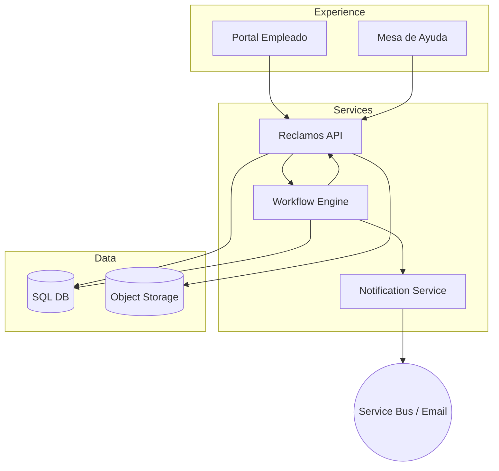

# Arquitectura · Reclamos / Nucleus WF

## Dominios heredados
| Dominio | Descripción | Fuente |
| --- | --- | --- |
| Reclamo | Datos generales (categoría, origen, proceso, proveedor, solución sugerida). | `Reclamos.NomadClass.xml` |
| Workflow | Etapas y transiciones (Inicial → PendClasif → PendResol → Resuelto → PendConf → Final). | `Workflow/NucleusRH/Base/QuejasyReclamos/Reclamo.WF.xml` |
| Notificaciones | Envío de correos y tareas pendientes. | `lib_v11.WFReclamos.RECLAMO.cs` |
| Documentos | Adjuntos digitales (`DOCUM_DIG_QYR`). | `DocumentosDigitales.NomadClass.xml` |
| Catalogos | Categorías, orígenes, procesos, tipo problema, oficinas. | `*.NomadClass.xml` |

## Componentes modernos

### Capas
1. **Reclamos API**
   - Endpoints CRUD, comentarios, timeline, SLA.
   - Administra catálogos y configuración.
   - Exposición de dashboards (pendientes, SLA, KPIs).
2. **Workflow Engine**
   - Temporal.io / Durable Functions representando etapas del reclamo.
   - Maneja asignaciones, reintentos, deadlines, tareas manuales.
3. **Notification / Integration**
   - Emails, Teams/Slack, ServiceNow/ITSM connectors.
   - Eventos `ReclamoCreado`, `ReclamoResuelto`, `ReclamoPendConf`.
4. **Storage**
   - Tabelas: `Reclamos`, `Estados`, `Comentarios`, `Adjuntos`, `SLA`, `Acciones`, `Catalogos`.
   - Blob storage para archivos adjuntos.
5. **Observabilidad**
   - Logging estructurado, métricas (reclamos abiertos, SLA), tracing (correlación por `reclamoId`).

## Modelo de datos (conceptual)
| Tabla | Campos clave |
| --- | --- |
| `Reclamos` | `Id`, `Codigo`, `CategoriaId`, `OrigenId`, `ProcesoId`, `Estado`, `CreadoPor`, `Prioridad`, `ProveedorId`, `SLA`, `LegajoId` |
| `ReclamoEstados` | `Id`, `ReclamoId`, `Estado`, `Fecha`, `Usuario`, `Observaciones` |
| `ReclamoComentarios` | `Id`, `ReclamoId`, `Usuario`, `Mensaje`, `Tipo` |
| `ReclamoAdjuntos` | `Id`, `ReclamoId`, `ArchivoUrl`, `Nombre`, `Tipo` |
| `Catalogos` | `Categorias`, `Origenes`, `Procesos`, `TipoProblema`, `Oficinas`, `Soluciones`, etc. |

## Integraciones
- **Entradas**: Portal Empleado, Mesa de Ayuda, APIs externas (ITSM).
- **Salidas**: Emails, Service Bus/Kafka, dashboards BI.
- **Dependencias**: Legajos (Personal) para obtener datos del empleado, Liquidación/Tiempos para anexar info contextual.

## Seguridad
- OIDC con roles `Empleado`, `MesaAyuda`, `Aprobador`, `Administrador`.
- Auditoría completa de cambios y adjuntos.
- Definición de SLA por categoría/proceso.

---
*Basado en `Workflow/.../Reclamo.WF.xml`, `lib_v11.WFReclamos.RECLAMO.cs`, catálogos `QuejasyReclamos/*.NomadClass.xml`.*
