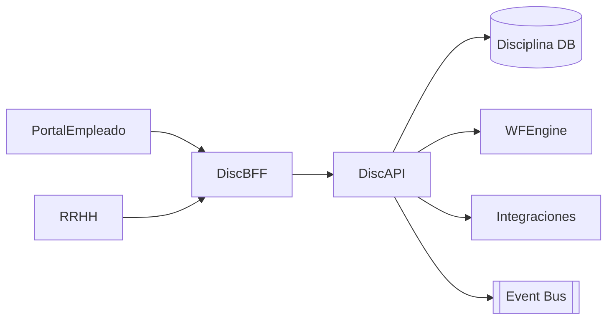

# Arquitectura · Sanciones / Disciplina

## Componentes

### Disciplina API
- Entidades: Sanciones, Tipos (amonestación, suspensión), Motivos, Historial, Documentos, Planes de mejora.
- Funciones: registrar sanciones, adjuntar documentos, capturar descargos, seguimiento, acuerdos.

### Workflow
- Etapas: reporte → investigación → descargo → resolución → seguimiento → cierre.
- Nucleus WF maneja aprobaciones, notificaciones y deadlines.

### Integraciones
- Legajos (datos del colaborador, historial), Organización (responsables), Evaluación (impactos), Portal Empleado (descargos/firmas), Integrations Hub (reportes legales).

## Modelo de datos (conceptual)
| Entidad | Campos |
| --- | --- |
| `DisciplinaryCases` | `Id`, `LegajoId`, `Tipo`, `MotivoId`, `Fecha`, `Estado`, `Detalles` |
| `CaseSteps` | `Id`, `CaseId`, `Etapa`, `Responsable`, `Fecha`, `Notas` |
| `CaseDocuments` | `Id`, `CaseId`, `Tipo`, `Url`, `Fecha` |
| `ActionPlans` | `Id`, `CaseId`, `Descripcion`, `Responsable`, `FechaCompromiso`, `Estado` |

## Seguridad
- Roles: RRHH, Supervisor, Legal, Empleado (descargo).
- Auditoría, privacidad, cumplimiento legal.

---
*Blueprint conceptual.*
