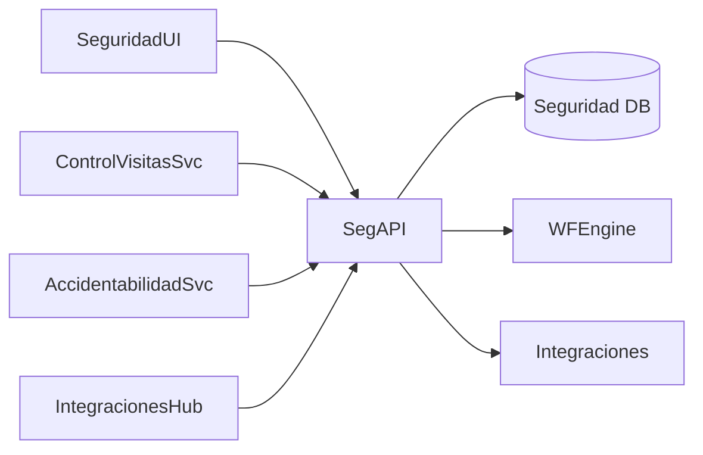

# Arquitectura · Seguridad física

## Componentes

### Seguridad API
- Entidades: Accesos (entradas/salidas), Rondas, Permisos especiales, Alertas, Eventos de seguridad, Dispositivos (turnos, cámaras), Reportes.
- Funciones: registrar accesos (manual/API), monitorear, generar alertas, autorizar permisos.

### Integraciones
- Control de Visitas y Portal Empleado (permisos e invitaciones).
- Control de acceso físico (APIs para torniquetes, badges, IoT).
- Sistemas de video/IoT (posible ingestión para alertas).
- Accidentabilidad y Medicina (incidentes de seguridad).

### Workflow
- Permisos especiales (acceso a zonas restringidas), alertas/incident management, rondas y checklists.

## Modelo de datos (conceptual)
| Entidad | Campos |
| --- | --- |
| `AccessEvents` | `Id`, `LegajoId` o `VisitanteId`, `Zona`, `Timestamp`, `Resultado`, `Dispositivo` |
| `SecurityAlerts` | `Id`, `Tipo`, `Zona`, `Fecha`, `Estado`, `Detalles`, `WorkflowInstanceId` |
| `Permits` | `Id`, `LegajoId`, `Zona`, `VigenciaDesde/Hasta`, `Estado` |
| `Rounds` | `Id`, `Zona`, `Responsable`, `Schedule`, `Estado`, `Checklist` |

## Seguridad
- Roles: Seguridad, Supervisor, Recepción, Admin.
- Alta criticidad: controles de auditoría, integridad, cifrado.

---
*Blueprint conceptual.*
