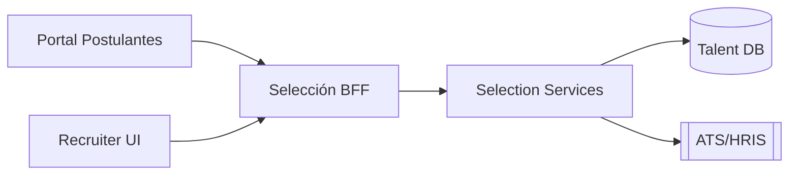

# Módulo Selección / WebCV · Blueprint

## Objetivo
Modernizar el módulo de Selección de Postulantes y el portal WebCV presente en Nucleus RH 23.01 (`WebCV/*`, `Class/NucleusRH/Base/SeleccionDePostulantes/*`). El objetivo es ofrecer una experiencia B2C para candidatos y un CRM de talento para equipos de RRHH.

## Funcionalidades actuales (23.01)
- **Portal WebCV**: registro/login (`WebCV/Templates/Pages/Login.htm`), postulación a avisos, recuperación de contraseña, consumo de métodos `NucleusRH.Base.SeleccionDePostulantes.CVs.CV`.
- **Clases de negocio**: `lib_v11.CVs.CV.NomadClass.cs` gestiona CVs, áreas, idiomas, experiencias, postulaciones.
- **Avisos**: reportes `WebCV/Templates/Pages/Avisos.htm`, clases `SeleccionDePostulantes/lib_v11.*`.
- **Procesos internos**: pipeline de candidatos, avisos activos, workflows para entrevistas.

## Diseño propuesto

### Componentes
1. **Selection API (ASP.NET Core)**: CRUD de avisos, candidatos, postulaciones, etapas del pipeline, entrevistas.
2. **Portal Postulantes (Next.js/SPA)**: registro/login (OIDC B2C), exploración de avisos, carga de CV, postulaciones, seguimiento.
3. **Recruiter UI**: pipeline Kanban, agenda de entrevistas, feedback colaborativo, campañas.
4. **Integraciones**: import/export con portales externos, LinkedIn, webs corporativas, y sincronización con Legajos/Liquidación cuando el candidato es contratado.

---
*Generado el 2026-03-09 a partir de `WebCV/*`, `Class/NucleusRH/Base/SeleccionDePostulantes/lib_v11.*`.*
