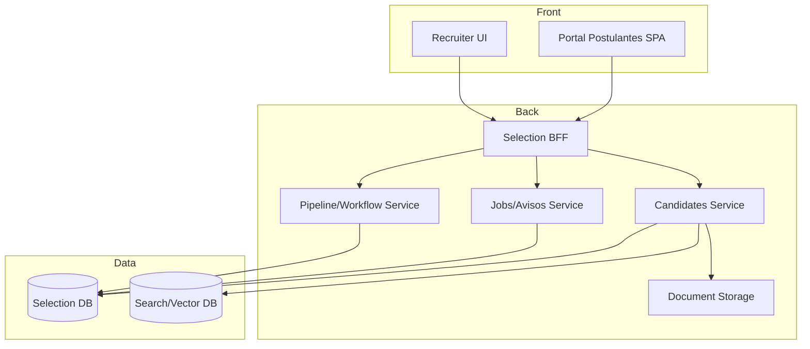

# Arquitectura · Selección / WebCV

## Dominios heredados
| Dominio | Descripción | Fuente 23.01 |
| --- | --- | --- |
| CV | Datos del postulante (datos personales, áreas, idiomas, experiencia). | `lib_v11.CVs.CV.NomadClass.cs`, `docs/06_modelo_datos.md` |
| Avisos | Publicaciones de empleo, filtros y postulaciones. | `WebCV/Templates/Pages/Avisos.htm`, `Class/.../Avisos` |
| Portal | HTML/JS clásico (Login, Registro, ShowCV). | `WebCV/Templates/Pages/*.htm` |
| Integraciones | Reportes WebCV, exportes a Selección de Postulantes. | `WebCV/Scripts/controls.js`, reportes `reportviewer.aspx` |

## Componentes propuestos

### Servicios
1. **Candidates Service**
   - Maneja perfiles, CV estructurado, adjuntos, versiones.
   - Endpoint para importar CV (PDF/LinkedIn) y extraer datos (NLP).
   - Sincroniza con módulo Personal al contratar.
2. **Jobs Service**
   - Administra avisos, campañas, preguntas knockout.
   - Publica avisos en portal, APIs externas.
3. **Pipeline Service**
   - Define etapas (Aplicado, Screening, Entrevistas, Oferta).
   - Gestiona feedback, agenda, tareas.
   - Integración con calendarios (Graph API).
4. **BFF/Graph API**
   - Endpoint unificado para SPA y recruiters.
   - Autenticación OIDC (B2C para candidatos, corporativo para recruiters).

## Modelo de datos (conceptual)
| Entidad | Campos clave |
| --- | --- |
| `Candidates` | `Id`, `Nombre`, `Email`, `Telefono`, `CVData`, `Estado` |
| `CandidateProfiles` | `Areas`, `Idiomas`, `Experiencias`, `Educacion`, `Skills` |
| `Jobs` | `Id`, `Titulo`, `Descripcion`, `Ubicacion`, `Categoria`, `Estado`, `Publicacion` |
| `Applications` | `Id`, `CandidateId`, `JobId`, `Estado`, `Fecha`, `Fuente`, `Notas` |
| `PipelineStages` | `Id`, `ApplicationId`, `Etapa`, `Responsable`, `Fecha`, `Feedback` |
| `Interviews` | `Id`, `ApplicationId`, `Fecha`, `Participantes`, `Resultado` |
| `Offers` | `Id`, `ApplicationId`, `Condiciones`, `Estado` |

## Integraciones
- **Entradas**: portales externos, LinkedIn Apply Connect, carga de CV, referidos.
- **Salidas**: integraciones con Personal (crear legajo), Liquidación (datos iniciales), ATS externos, analítica.
- **Search**: motor (Elastic/OpenSearch) o vector DB para matching candidato-aviso.

## Seguridad
- Candidatos: OIDC B2C (registro/login con email/LinkedIn/Google).
- Recruiters: OIDC corporativo + roles (Recruiter, Hiring Manager, Admin).
- Data privacy: GDPR/ISO (consentimiento, eliminación de datos, retención).

---
*Basado en `WebCV` templates/scripts y clases `SeleccionDePostulantes`.*
