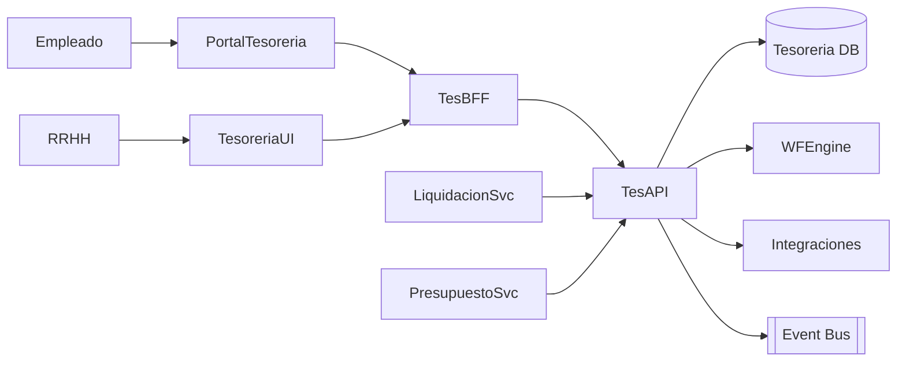

# Arquitectura · Tesorería RRHH

## Componentes

### Tesorería API
- Entidades: Adelantos, Préstamos, Viáticos, Pagos puntuales, Fondos fijos, Conciliaciones bancarias, Historico de pagos.
- Funciones: solicitud/aprobación, calendario de pagos, generación de órdenes bancarias, conciliación con extractos.

### Workflow
- Etapas: solicitud → aprobación (manager/RRHH/Tesorería) → desembolso → seguimiento/conciliación → cierre.

### Integraciones
- **Liquidación**: pagos de nómina (reales, agenda) y deducciones futuros (adelantos a descontar).
- **Integrations Hub**: exportes bancarios (ACH/SPEI/TEF), reportes contables.
- **Presupuesto**: control de fondos vs presupuesto aprobado.
- **ERP/Tesorería Corporativa**: asientos contables, conciliaciones globales.

## Modelo de datos (conceptual)
| Entidad | Campos |
| --- | --- |
| `PaymentRequests` | `Id`, `LegajoId`, `Tipo`, `Monto`, `Moneda`, `Estado`, `Motivo`, `WorkflowInstanceId` |
| `Payments` | `Id`, `RequestId`, `FechaPago`, `Método`, `Cuenta`, `Comprobante`, `Estado` |
| `Funds` | `Id`, `Nombre`, `Monto`, `Saldo`, `Responsable` |
| `Reconciliations` | `Id`, `Periodo`, `Cuenta`, `MontoBanco`, `MontoSistema`, `Diferencia`, `Notas` |

## Seguridad
- Roles: Empleado, Manager, Tesorería RRHH, Tesorería Corporativa, Auditor.
- Auditoría y segregación de funciones (SoD).

---
*Blueprint conceptual.*
