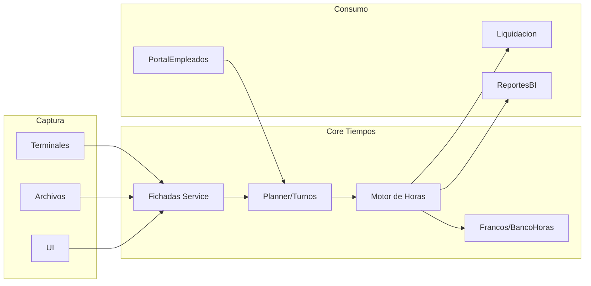

# Módulo Tiempos Trabajados · Blueprint

## Objetivo
Modernizar el módulo de Tiempos Trabajados (TTA) presente en Nucleus RH 23.01 (`Menu/NucleusRH/Base/TTA.menu.xml`, interfaz `Interfaces/NucleusRH/Base/Tiempos_Trabajados/Liquidacion/ArchivoHoras.XML`, procedimientos SQL `TTA*`). Este módulo gestiona fichadas, horarios, turnos, licencias, novedades y procesamientos de horas para alimentar Liquidación.

## Funciones actuales (23.01)
- **Captura y gestión de fichadas**: ingreso desde archivo, terminal, tabla intermedia o manual (`FichadasIng.*`). Permite editar/verificar fichadas y asignaciones masivas.
- **Mantenimiento de horarios/turnos**: ABM de turnos, grupos de horarios, tipos de hora, bancos de horas.
- **Planillas / cargas masivas**: planillas para cambios de turnos, licencias según rol, novedades según rol.
- **Procesamiento de horas**: cálculo de horas trabajadas, compensatorios, interface de conceptos (`NucleusRH.Base.Tiempos_Trabajados.Liquidacion.flow`), exporte `ArchivoHoras.XML` hacia Liquidación.
- **Reportes**: asistencias, novedades, horas procesadas, conceptos calculados.

## Diseño propuesto

## Capas
1. **Servicios dedicados**
   - `fichadas-service`: ingesta de registros (API + colas), validaciones y normalización.
   - `scheduler-service`: manejo de horarios/turnos/asignaciones y planillas.
   - `processor-service`: cálculo de horas/trato de licencias/novedades + exportes.
   - `comp-service`: manejo de bancos de horas y francos compensatorios.
2. **Base de datos**: tablas `Fichadas`, `Turnos`, `Horarios`, `Asignaciones`, `Procesamientos`, `ConceptosCalculados`, `BancosHoras`, alineado a los artefactos TTA.
3. **Integraciones**
   - Entrada: terminales (API/FTP), archivos CSV, importaciones manuales.
   - Salida: `ArchivoHoras` modernizado (JSON/CSV + eventos), feed para Liquidación y BI.
4. **UI**
   - Panel operativo (fichadas, horarios, novedades, planillas).
   - Reportes interactivos (presentismo, parte diario, horas x concepto).

## Artefactos a producir
- Documentación (este folder).
- Blueprint API/services.
- Maqueta UI extendida para mostrar paneles de Tiempos.

---
*Generado el 2026-03-09 a partir de `TTA.menu.xml`, `ArchivoHoras.XML` y scripts SQL del módulo TTA.*
