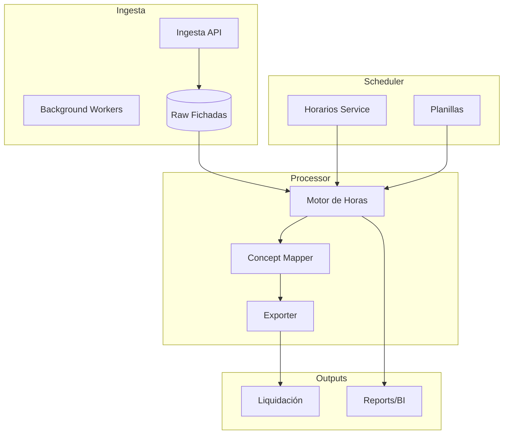

# Arquitectura · Tiempos Trabajados

## Dominios principales
| Dominio | Responsabilidad | Artefactos legados |
| --- | --- | --- |
| Fichadas | Captura, validación y correcciones de registros de entrada/salida. | `FichadasIng.*`, `Interfaces.Kubo`, `TTA.AK08_Fichadas.sql` |
| Horarios / turnos | Definir turnos, horarios, grupos y asignarlos a legajos. | `Horarios.flow`, `Turnos.flow`, planillas de cambios |
| Novedades/Licencias | Registrar ausencias, licencias y novedades masivas. | `LicenciasSec`, `NovedadesSec`, importadores |
| Procesamientos | Calcular horas normales/extras, conceptos, alimentar Liquidación. | `Liquidacion.flow`, `ArchivoHoras.XML`, stored procedures `TTA.sp_*` |
| Compensatorios | Banco de horas, francos compensatorios, aprobaciones. | `AdministracionFC.*` |
| Reportes | Planillas, parte diario, horas procesadas, conceptos. | `Reporte.*` |

## Componentes modernos

## Microservicios sugeridos
1. **`tta-ingest-service`**
   - Endpoints/APIs para registrar fichadas (terminales, manual, archivo) y validarlas.
   - Encola registros para procesamiento (RabbitMQ/Service Bus).
   - Normaliza campos (terminal, legajo, fecha, tipo de evento).
2. **`tta-scheduler-service`**
   - CRUD de turnos, horarios, grupos y asignaciones por legajo.
   - Maneja planillas masivas (CSV/Excel) y verifica conflictos.
   - Expone endpoints para licencias/novedades según rol.
3. **`tta-processor-service`**
   - Consume fichadas y horarios, calcula horas normales/extras, licencias, conceptos.
   - Aplica reglas configurables (similar a stored `TTA.sp_*`).
   - Genera resultados por legajo/procesamiento.
4. **`tta-comp-service`**
   - Banco de horas, francos compensatorios, aprobaciones y recalculos.
5. **`tta-reporting`** (opcional inicial)
   - API específica para reportes (parte diario, planillas) o feed a data warehouse.

## Modelo de datos (conceptual)
| Entidad | Campos clave | Descripción |
| --- | --- | --- |
| Fichada | `Id`, `LegajoId`, `TerminalId`, `FechaHora`, `Tipo` | Registros brutos de reloj |
| HorarioAsignado | `Id`, `LegajoId`, `TurnoId`, `FechaDesde/Hasta` | Programación |
| Turno | `Id`, `Nombre`, `DetalleHoras`, `Descansos` | Turnos estándar |
| Novedad | `Id`, `LegajoId`, `Tipo`, `FechaDesde/Hasta`, `Fuente` | Licencias/ausencias |
| Procesamiento | `Id`, `Periodo`, `Estado`, `Criterio`, `Resultado` | Batch de cálculo |
| ResultadoHora | `Id`, `ProcesamientoId`, `LegajoId`, `TipoHora`, `Cantidad`, `Concepto` | Salida para Liquidación |
| BancoHora | `Id`, `LegajoId`, `Saldo`, `Movimientos[]` | Francos compensatorios |

## APIs principales
- `POST /fichadas` (ingesta manual/terminal), `POST /fichadas/import` (archivo), `GET /fichadas?legajoId=&fecha=`.
- `POST /horarios/asignaciones`, `GET /horarios/legajos/{id}`.
- `POST /procesamientos` (iniciar), `GET /procesamientos/{id}`, `POST /procesamientos/{id}/aprobar`.
- `GET /procesamientos/{id}/export` (CSV/JSON similar a `ArchivoHoras`).
- `POST /compensatorios` (movimientos), `POST /compensatorios/{id}/aprobar`.

## Integraciones
- **Entradas**: terminales (API/FTP), Kubo (API REST), archivos CSV de licencias/novedades.
- **Salidas**: exportes CSV/JSON (Liquidación), eventos `HorasCalculadas` para analítica.
- **Dependencias**: requiere Legajos (módulo Personal) para validar legajo/posición/centro costo.

## Seguridad y trazabilidad
- OIDC + roles (`Tiempos.Operador`, `Tiempos.Supervisor`, `Tiempos.Admin`).
- Auditoría de fichadas modificadas, logs de procesamiento, bitácora de planillas.
- Soporte a aprobaciones (p.ej., cambios de turnos, francos compensatorios).

---
*Referencias: `TTA.menu.xml`, `Interfaces/.../ArchivoHoras.XML`, scripts `TTA.sp_*`.*
