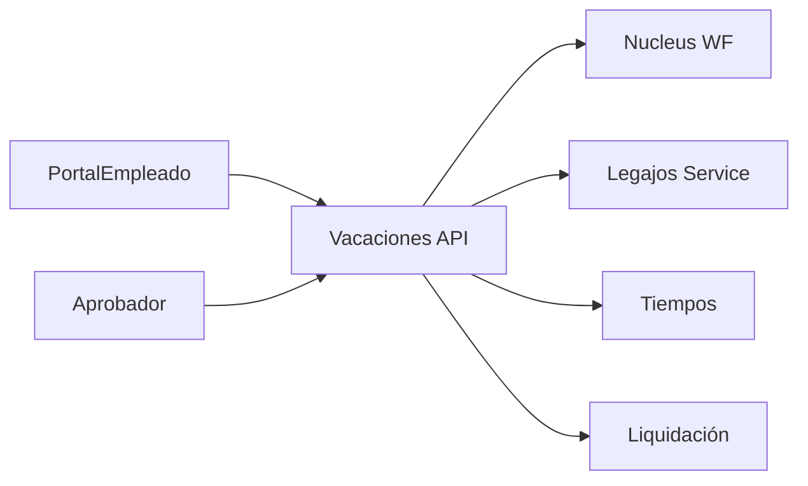

# Arquitectura · Vacaciones / Autoservicio

## Dominios clave
| Dominio | Descripción | Fuente 23.01 |
| --- | --- | --- |
| Solicitud | Datos de la solicitud (fechas, días, motivo, l_automatica). | `Solicitud.WF.xml`, `lib_v11.WFSolicitud.SOLICITUD` |
| Legajo Vacaciones | Gestión de saldos, agregados, aprobaciones (`LegajoVacaciones.PERSONAL_EMP`). | `lib_v11.WFSolicitud.SOLICITUD` |
| Workflow | Etapas y eventos (`SOLICITAR`, `PENDAPROB`, `FINALIZADA`). | `Workflow/NucleusRH/Base/Vacaciones/Solicitud.WF.xml` |

## Componentes propuestos

### Servicios
1. **Vacaciones API**
   - Endpoints CRUD de solicitudes, simulador de saldo, políticas.
   - Calcula días hábiles, feriados, bonificados.
2. **WF Engine**
   - Orquesta el workflow (solicitar, aprobar/rechazar, finalizar), maneja SLA y delegaciones.
3. **Integraciones**
   - Tiempos: bloquea horarios, actualiza bancos de horas.
   - Liquidación: expone eventos para liquidar vacaciones pagas.
   - Notificaciones: email/Teams, recordatorios.

## Modelo de datos (conceptual)
| Entidad | Campos |
| --- | --- |
| `VacationRequests` | `Id`, `LegajoId`, `Periodo`, `FechaDesde/Hasta`, `Dias`, `Tipo`, `Estado`, `Motivo`, `Automatica`, `WorkflowInstanceId` |
| `VacationBalances` | `LegajoId`, `Periodo`, `DiasDisponibles`, `DiasTomados`, `DiasBonificados`, `UltimaActualizacion` |
| `VacationPolicies` | `EmpresaId`, `Antiguedad`, `Dias`, `Reglas` |

## Integraciones event-driven
- `VacationRequested`, `VacationApproved`, `VacationRejected`, `VacationCancelled`.
- Consumidores: Tiempos, Liquidación, Analytics.

## UI/UX
- Portal empleado: calendario interactivo, simulador, historial, estado.
- Aprobadores: bandeja con saldo, reemplazantes, KPIs.

## Seguridad
- Roles: empleado, jefe directo, RRHH.
- Validaciones: saldo suficiente, solapamientos, feriados, políticas multi-país.

---
*Basado en clases `lib_v11.WFSolicitud.SOLICITUD` y workflow Vacaciones.*
