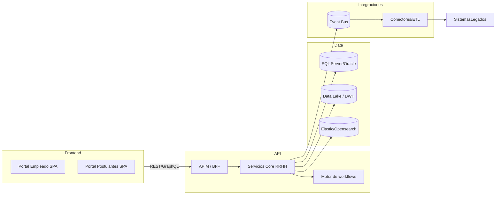

# Propuesta de actualizacion tecnologica - Nucleus RH 23.01

## 1. Resumen ejecutivo
- La version 23.01 opera sobre el framework Nomad (.NET Framework) con formularios XML, workflows definidos en `Workflow/*` y un portal WebCV en HTML clasico (`WebCV/Templates/Pages`).
- La logica de negocio reside en clases parciales C# (ej. `Class/NucleusRH/Base/Vacaciones/lib_v11.WFSolicitud.SOLICITUD.NomadClass.cs`) y se apoya en servicios Nomad (`NomadProxy`, `SQLService`, `FileServiceIO`).
- La documentacion existente en `docs/*.md` describe modulos funcionales, flujos y el mapa de artefactos; no hay pipelines CI/CD ni empaquetado moderno.
- Se propone una transformacion por etapas hacia una plataforma basada en servicios ASP.NET Core / .NET 8, APIs REST/GraphQL, frontend modular (React + design system) y orquestacion de workflows desacoplada (Temporal/Logic Apps), manteniendo interoperabilidad con SQL Server/Oracle y migrando integraciones a colas/eventos.

## 2. Evaluacion del estado actual

### 2.1 Arquitectura observada
- **Presentacion**: combinacion de WebCV (HTML+JS vanilla con helpers de Nomad) y formularios definidos en `Form/` renderizados por el runtime Nomad (ver `docs/02_arquitectura_y_componentes.md`).
- **Servicios**: clases estaticas que manipulan XMLs y DDOs Nomad; fuerte acoplamiento a NomadEnvironment y workflows XML (`docs/03_flujos_y_workflows.md`).
- **Datos**: scripts y metadata en `Database/base11desa.xml` sin versionado declarativo; queries embebidas en XML de interfaces (`docs/06_modelo_datos.md`).
- **Integraciones**: generador generico (`InterfacesOut/Source/Generico`) que ejecuta queries y genera archivos planos; entradas por XML en `Interfaces/NucleusRH/*` (`docs/05_interfaces_e_integraciones.md`).

### 2.2 Calidad de codigo y mantenibilidad
- Ausencia de pruebas automatizadas (`docs/08_casos_de_prueba.md` solo describe casos manuales) y de pipelines CI/CD.
- Uso intensivo de XML y cadenas para passing data, lo que dificulta refactors y validacion en compilacion.
- Frontend con dependencias a funciones globales (`parent.ExecuteNomadMethod` en `WebCV/Templates/Pages/Login.htm`) y sin bundler.
- Falta de separacion clara entre capas y ausencia de patrones DDD/clean architecture; la logica se encuentra mezclada con acceso a datos y orquestacion.

### 2.3 Riesgos principales
1. **Obsolescencia tecnologica**: .NET Framework legado, dependencias Nomad propietarias y JS sin build system.
2. **Escalabilidad y observabilidad limitadas**: no hay contenedores, telemetria ni tracing.
3. **Mantenibilidad baja**: workflows definidos en XML con reglas en C# estatico hacen dificil la evolucion.
4. **Seguridad**: el portal WebCV realiza validaciones minimas y expone patrones vulnerables (ej. alerts, envio de claves por mail).
5. **Operaciones manuales**: generacion de interfaces y despliegues parecen on-premises sin automatizacion.

## 3. Objetivos estrategicos de la actualizacion
- Modernizar la plataforma hacia servicios cloud-native, independientes del framework Nomad.
- Mejorar experiencia de usuario (empleados, postulantes, RRHH) con interfaz responsiva y accesible.
- Aumentar calidad y time-to-market mediante pipelines CI/CD, pruebas automatizadas y observabilidad.
- Garantizar cumplimiento regulatorio (RRHH, payroll) con trazabilidad end-to-end y gestion de datos segura.
- Establecer base para extender funcionalidades (analytics, autoservicio, integraciones SaaS) sin reescrituras completas.

## 4. Arquitectura objetivo propuesta

### 4.1 Vista general

### 4.2 Cambios por capa
- **Frontend**: React + TypeScript (Next.js) con design system corporativo, autenticacion OIDC, i18n y libreria de componentes compartidos entre Portal Empleado y WebCV. Testing con Playwright/Cypress, bundler Vite/Turbopack.
- **APIs y servicios**: microservicios modulares (Personal, Liquidacion, Vacaciones, Reclamos, Seleccion) sobre ASP.NET Core / .NET 8, patrones DDD + CQRS, llamadas asincronas via MassTransit + RabbitMQ/Service Bus; GraphQL para consultas complejas.
- **Workflows**: migrar definiciones XML a un motor moderno (Temporal, Durable Functions o Logic Apps) con versionado, monitoreo y soporte a SLA; exponer workflows como APIs gRPC/HTTP.
- **Datos**: adoptar EF Core + migraciones, versionado de schema (Flyway/Liquibase), cifrado transparente, snapshots para auditorias, replica en Data Lake (ADLS/S3) para BI.
- **Integraciones**: reemplazar generador de archivos por pipelines event-driven; exponer conectores modulares (Azure Data Factory, AWS AppFlow) y plantillas de documentos firmados digitalmente.
- **Infraestructura y DevOps**: contenedores (Docker) desplegados en AKS/EKS o Kubernetes on-prem, IaC con Bicep/Terraform, pipelines GitHub Actions/Azure DevOps con stages (build, test, deploy), observabilidad con OpenTelemetry + Grafana/Prometheus + Application Insights.
- **Seguridad y cumplimiento**: Identity Provider central (Azure AD B2C/Keycloak), politicas de secret management (Key Vault), auditorias completas y retencion de logs.

## 5. Estrategia de migracion (por fases)
1. **Fase 0 - Fundaciones (4-6 semanas)**: inventario detallado (usar `docs/09_mapa_artefactos.md`), definir dominio y limites Bounded Context, implementar pipeline CI/CD basico para compilar y ejecutar pruebas unitarias contra codigo legado.
2. **Fase 1 - Envoltorios y APIs**: exponer funcionalidades criticas mediante APIs REST alrededor del core legado (pattern strangler). Implementar un Gateway (YARP/Kong) y autenticacion unificada.
3. **Fase 2 - Experiencia de usuario**: construir nuevo Portal Empleado y WebCV SPA consumiendo las APIs; migrar workflows de autoservicio (Vacaciones, Datos Personales) primero.
4. **Fase 3 - Dominio y workflows**: reimplementar servicios core en .NET 8 con DDD; migrar workflows a motor moderno y eliminar dependencias Nomad.
5. **Fase 4 - Integraciones y datos**: mover interfaces batch a eventos/ETL, poblar Data Lake, habilitar dashboards operacionales y machine learning para analytics de RRHH.
6. **Fase 5 - Optimizaciones**: hardening de seguridad, pruebas de performance, automatizacion de despliegues multi-ambiente y soporte multi-tenant.

## 6. Hoja de ruta de entregables
- **Q1**: pipelines CI/CD, entorno contenedorizado de desarrollo, API gateway inicial, PoC Temporal/Durable Functions.
- **Q2**: servicios Personal y Vacaciones en .NET 8 + base EF Core; nuevo Portal Empleado (autoservicio) y autenticacion OIDC productiva.
- **Q3**: migracion completa de workflows Reclamos y Seleccion, integraciones event-driven payroll/bancos, Data Lake minimo viable.
- **Q4**: observabilidad avanzada, reglas de compliance (firmas digitales, retencion) y capacidad de extender modulos (Capacitacion, Medicina Laboral).

## 7. KPIs y medicion
- Tiempo promedio para desplegar cambios (<1 dia vs semanas actuales).
- Cobertura automatizada (unit + integration) >= 70 % en modulos nuevos.
- SLA de autoservicio > 99 % y NPS del portal >= 50.
- Reduccion del 80 % en incidencias por fallos de integracion (bus de eventos vs archivos manuales).
- Trazabilidad completa de workflows con logs correlacionados (OpenTelemetry).

## 8. Proximos pasos inmediatos
1. Validar alcance con stakeholders RRHH y TI usando `docs/01_vision_general.md` y `docs/07_casos_de_uso.md` como base.
2. Crear repositorios nuevos (frontend, servicios, infraestructura) y definir convenciones de branch/commit.
3. Seleccionar stack final (ASP.NET Core 8, React 18, Temporal/Logic Apps, RabbitMQ/Azure Service Bus) y adquirir licenciamiento necesario.
4. Levantar PoC de portal SPA autenticado y un workflow migrado (Solicitud de Vacaciones) para demostrar end-to-end.

---
Documento generado desde la evaluacion del repositorio `23.01` (carpeta raiz `C:\Proyectos\23.01-base\23.01`) y la documentacion existente en `docs/`.
